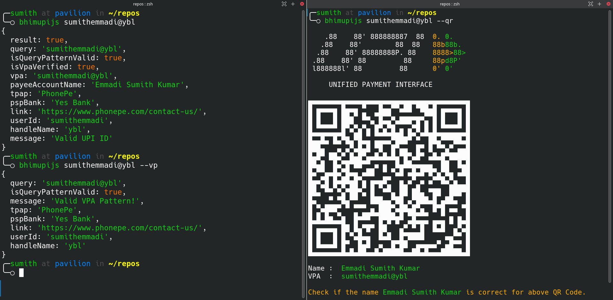

# bhimupijs
[](https://www.npmjs.com/package/bhimupijs)
[](https://github.com/sumithemmadi/bhimupijs/stargazers)
[](https://github.com/sumithemmadi/bhimupijs)
[](https://github.com/sumithemmadi/bhimupijs/blob/main/LICENSE)
[](https://github.com/sumithemmadi/bhimupijs/issues)
[](https://github.com/sumithemmadi/bhimupijs)

BHIMUPIJS is a npm module which can  validate, verify  and generate QR Codes for UPI IDs.

## Installation
Install this npm package globally.
```bash
npm install -g bhimupijs
```
Or Install it locally if you want to use it in your project.

```bash
npm install bhimupijs
```
and use it like
```js
const { verifyUPI } = require("bhimupijs")
```
# Usage
### CLI

```
~$ bhimupijs --help

Usage:
bhimupijs [VPA] (command to validate VPA).

Options:
    --version                Show version number                [boolean]
-n, --name                   Print's payee name                 [boolean]
    --validate-pattern, --vp Validate VPA pattern               [boolean]
    --qrcode, --qr           Print's QR Code of vpa             [boolean]
-h, --help                   Show help                          [boolean]

Examples:
  bhimupijs sumithemmadi@upi
  bhimupijs sumithemmadi@upi --qr     Print's QR code of the vpa

  Only install this package from npm 'npm install -g bhimupijs' or
  https://github.com/sumithemmadi/bhimupijs
```
### Verifying  UPI ID
```yaml
~$ bhimupijs sumithemmadi@ybl
{
  result: true,
  query: 'sumithemmadi@ybl',
  isQueryPatternValid: true,
  isVpaVerified: true,
  vpa: 'sumithemmadi@ybl',
  payeeAccountName: 'Emmadi Sumith Kumar',
  tpap: 'PhonePe',
  pspBank: 'Yes Bank',
  link: 'https://www.phonepe.com/contact-us/',
  userId: 'sumithemmadi',
  handleName: 'ybl',
  message: 'Valid UPI ID'
}
```
- This will verify UPI ID
### Validating UPI ID
```yaml
~$ bhimupijs sumithemmadi@ybl --vp
{
  query: 'sumithemmadi@ybl',
  isQueryPatternValid: true,
  message: 'Valid VPA Pattern!',
  tpap: 'PhonePe',
  pspBank: 'Yes Bank',
  link: 'https://www.phonepe.com/contact-us/',
  userId: 'sumithemmadi',
  handleName: 'ybl'
}
```
- `--vp` is used to validate UPI ID without verifying it. This will check if the given UPI Id has a valid pattern.
- It will not verify the UPI Id

### Print QR Code 

```sh
~$ bhimupijs sumithemmadi@ybl --qrcode 
```


# Name

```sh
~$ bhimupijs sumithemmadi@ybl --name 
Name : Emmadi Sumith Kumar
```
- Here `--name` is used to print the name of a verified UPI ID.

## NodeJS

### Verifing UPI ID 
```js
const { verifyUPI } = require("bhimupijs")

const vpa = "sumithemmadi@ybl";

async function verify(vpa){
    var upiData = await verifyUPI(vpa)  
    console.log(upiData)
}

verify(vpa)

// {
//   result: true,
//   query: 'sumithemmadi@ybl',
//   isQueryPatternValid: true,
//   isVpaVerified: true,
//   vpa: 'sumithemmadi@ybl',
//   payeeAccountName: 'Emmadi Sumith Kumar',
//   tpap: 'PhonePe',
//   pspBank: 'Yes Bank',
//   link: 'https://www.phonepe.com/contact-us/',
//   userId: 'sumithemmadi',
//   handleName: 'ybl',
//   message: 'Valid UPI ID'
// }
```

### Validating UPI ID
```js
const { validatePattern } = require("bhimupijs")

var data =  validatePattern("sumithemmadi@ybl")  // validatePattern function only validate the  UPI ID pattern.
console.log("data")

// {
//   query: 'sumithemmadi@ybl',
//   isQueryPatternValid: true,
//   message: 'Valid VPA Pattern!',
//   tpap: 'PhonePe',
//   pspBank: 'Yes Bank',
//   link: 'https://www.phonepe.com/contact-us/',
//   userId: 'sumithemmadi',
//   handleName: 'ybl'
// }
```
## LICENSE

MIT License

Copyright (c) 2022 Emmadi Sumith Kumar

Permission is hereby granted, free of charge, to any person obtaining a copy
of this software and associated documentation files (the "Software"), to deal
in the Software without restriction, including without limitation the rights
to use, copy, modify, merge, publish, distribute, sublicense, and/or sell
copies of the Software, and to permit persons to whom the Software is
furnished to do so, subject to the following conditions:

The above copyright notice and this permission notice shall be included in all
copies or substantial portions of the Software.

[](https://github.com/sumithemmadi/bhimupijs)